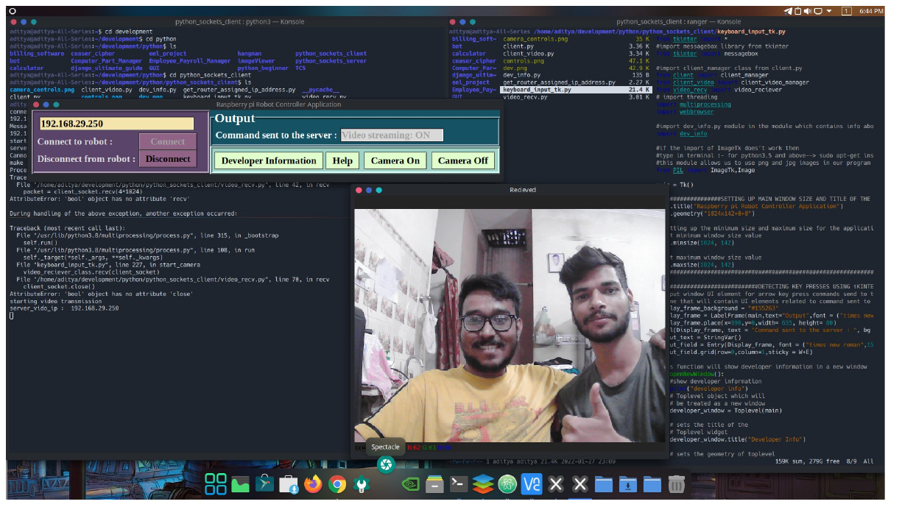

# Introduction
This project is about developing a wirelessly controlled Robot based onRaspberry pi single board computer. This project has the following main
functionality :
- Accepting wireless movement controls from client app in real-time forrobot movements.
- Transmitting video feed to the client application in real-time.Digital connectivity with HD video transmission.

## Purpose of the project :
- Rescue Missions : people during a natural disaster for example: Rescuing people fromThis robot can be used by NDRF teams to rescue
  the rubles of a collapsed building after a massive earthquake. Recon mission : This robot can be used by Indian army to carry out.
- recon missions to locate enemies for example : Indian army can usethis robot to carry out recon mission during close quarter combat in
  urban environment and locate the enemies from relatively safedistance.
- Mobile home surveillance : want to keep an eye on their pets while they are away from home.This robot can be used by people who

## Tech Stack used :
### Hardware :
- Raspberry piJumper wires
- H bridge motor controller LN298 ICCamera module
- Electric DC motorsRobot Chassis , switches, multi-power delivery usb system
- Power supply

### Software :
- Atom IDE ( Ubuntu Linux workstation )
- Python programming languageLibraries used
- Linux OS ( Raspbian OS )Geany IDE ( Raspberry pi )
- Only Office for documentation ( Ubuntu Linux workstation )

### Note :
#### For more information I have included the documentation related to this project feel free to check that out. The documentation of this project is named ```rpi_robot.pdf``` https://github.com/aryan68125/raspberry_pi_robotics/blob/master/rpi_robot.pdf

## Here is a demo video of the raspberry pi robot
https://github.com/aryan68125/raspberry_pi_robotics/assets/32859662/f359e8f8-58ff-4817-b0d2-8651eb24b4cd


https://github.com/aryan68125/raspberry_pi_robotics/assets/32859662/79353da6-f203-4869-ad57-5db01a97066e

## This how the desktop application looks like that controls the robot



