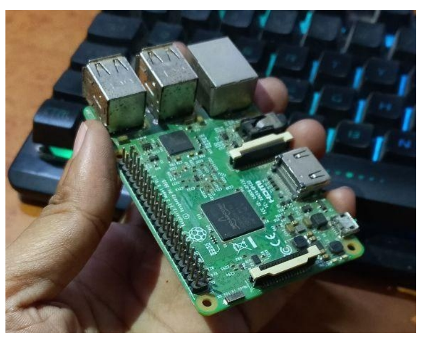

# Introduction
This project is about developing a wirelessly controlled Robot based onRaspberry pi single board computer. This project has the following main
functionality :
- Accepting wireless movement controls from client app in real-time forrobot movements.
- Transmitting video feed to the client application in real-time.Digital connectivity with HD video transmission.

## Purpose of the project :
- Rescue Missions : people during a natural disaster for example: Rescuing people fromThis robot can be used by NDRF teams to rescue
  the rubles of a collapsed building after a massive earthquake. Recon mission : This robot can be used by Indian army to carry out.
- recon missions to locate enemies for example : Indian army can usethis robot to carry out recon mission during close quarter combat in
  urban environment and locate the enemies from relatively safedistance.
- Mobile home surveillance : want to keep an eye on their pets while they are away from home.This robot can be used by people who

## Tech Stack used :
### Hardware :
- Raspberry piJumper wires
- H bridge motor controller LN298 ICCamera module
- Electric DC motorsRobot Chassis , switches, multi-power delivery usb system
- Power supply

### Software :
- Atom IDE ( Ubuntu Linux workstation )
- Python programming languageLibraries used
- Linux OS ( Raspbian OS )Geany IDE ( Raspberry pi )
- Only Office for documentation ( Ubuntu Linux workstation )

# Hardware

## Raspberry pi :

The Raspberry Pi is a low cost,computer monitor or TV, and uses a standard keyboard and mouse. It is a **credit-card sized computer** that plugs into a
capable little device that enables people of all ages to explore computing, andto learn how to program in languages like Scratch and Python. It’s capable of
doing everything you’d expect a desktop computer to doRaspberry Pi has the ability to interact with the outside world, and has been. What’s more, the
used in a wide array of digital maker projects, from music machines and parentdetectors to weather stationsetc.
